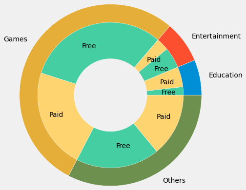

# analysis-of-appstore-apps
Analysis is based on cost,category and rating
I did EDA on appstore apps!  
The analysis was based on the input of graphs that determine the relationship between `rating`, `price` and `category`. And Finaly i demonstrated  this contact on this graph  
  
Also i made the folowing conclusions:
* Count of paid apps is exponentially decreases as the price increases
* Very few apps have been priced above 25 $. So its important to keep price of your app below 25$  
* Paid gaming apps are highly priced and distribution extends till 25 $  
* Education has significant % of Paid apps.  
